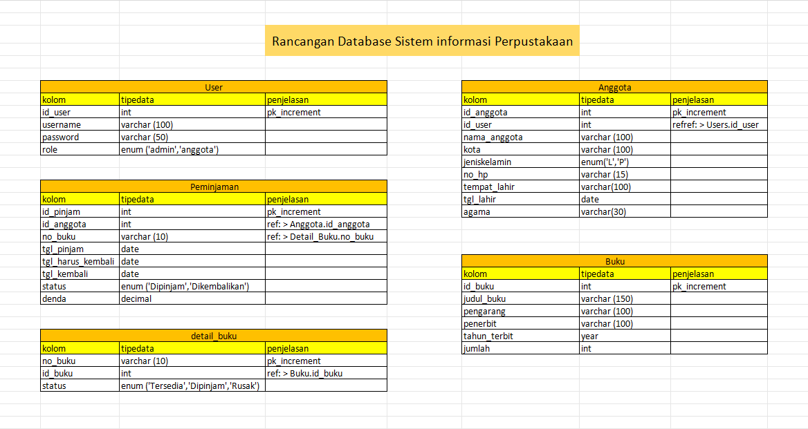

still on going

# 📚 Sistem Informasi Perpustakaan

Aplikasi manajemen perpustakaan berbasis Laravel dengan fitur lengkap seperti pengelolaan buku, anggota, peminjaman, dan pengembalian.
Tampilan menggunakan Otika Admin Template + DataTables.

## ✨ Fitur Utama
👤 Manajemen Anggota

- Tambah, edit, hapus anggota

- Pencarian dan filter

- Riwayat peminjaman anggota

📘 Manajemen Buku

- Tambah / edit / hapus buku

- Kelola kategori buku

- Stok buku otomatis berkurang & bertambah saat dipinjam/dikembalikan

📄 Manajemen Peminjaman

- Tambah peminjaman baru

- Pilih lebih dari 1 buku

- Menyimpan detail peminjaman

- Status peminjaman (Dipinjam, Dikembalikan)

🔁 Pengembalian Buku

- Proses pengembalian per buku

- Fitur denda

# Rancangan Struktur Database

|   |
----------------------------------------------------------
